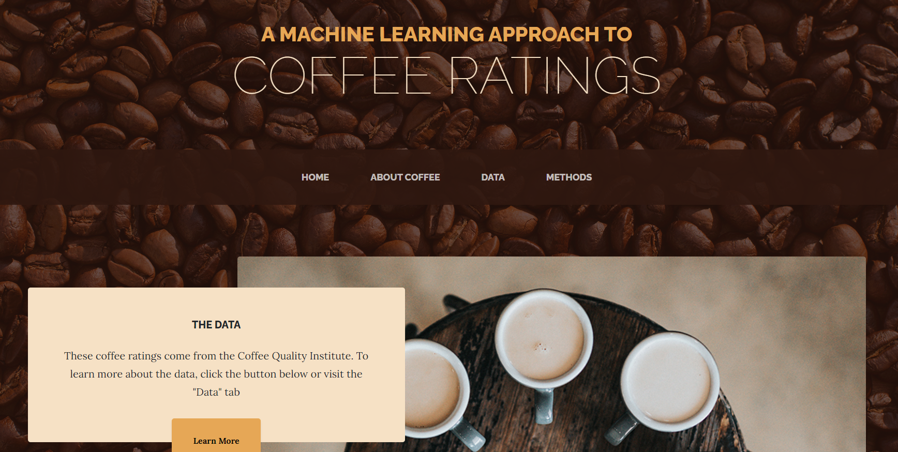
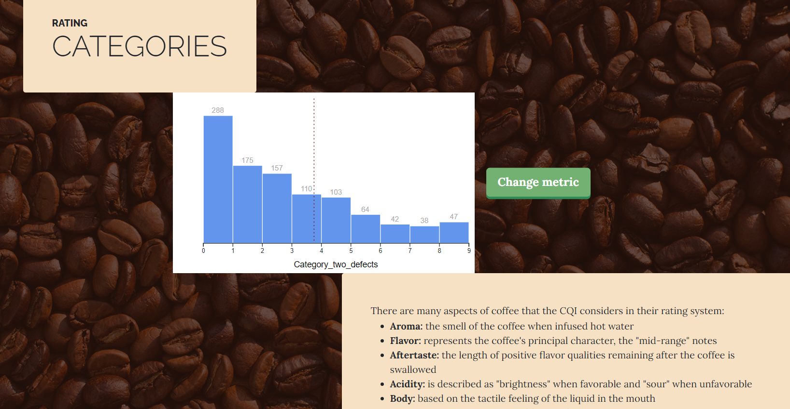
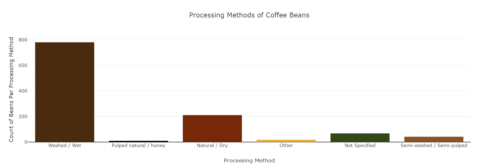
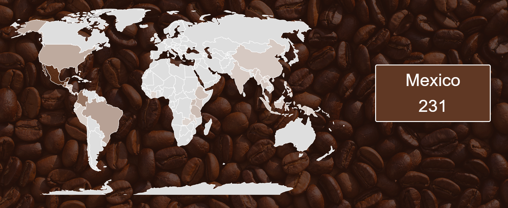
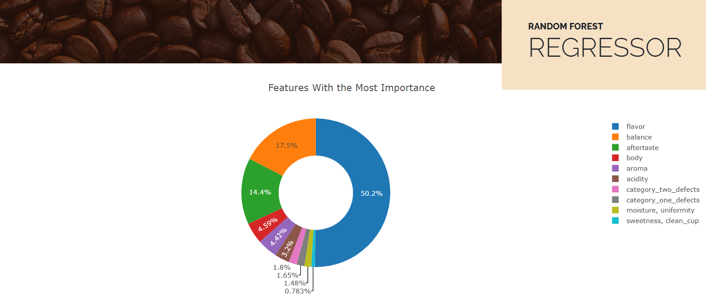
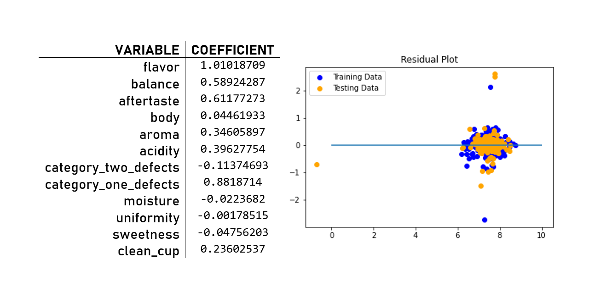
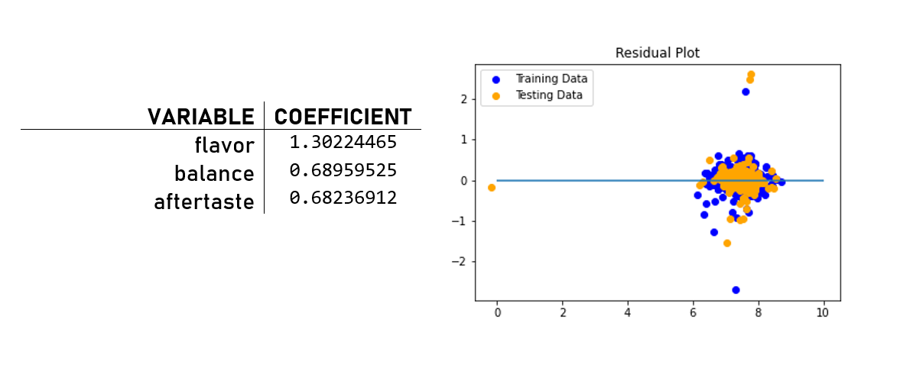

# A Machine Learning Approach to Coffee Ratings
  

  
# Overview
### The goal of this project was to explore data on the ratings of coffee cups through the use of data visualization and machine learning algorithms. The home page for this project was deployed via Google Cloud and can be found at [https://uncfinalproject.uc.r.appspot.com/](https://uncfinalproject.uc.r.appspot.com/)
  
  
# Tools
* Programming/Scripting Languages
  * Python
  * JavaScript
  * R
  * HTML
  * CSS
* Packages
  * Plotly
  * Plotly Express
  * Pandas
  * Scikit-learn
  * D3
* Technologies/IDEs  
  * Jupyter Notebook
  * Visual Studio Code
  * Google Cloud
  * MongoDB
  * Flask API
  
  
# About the Data

The data come from the Coffee Quality Institute, "a non-profit organization working internationally to improve the quality of coffee and the lives of people who produce it". One thing they are known for is promoting a common language about the quality of coffee. The data provides a wide variety of variables related to the coffee cups tasted; we chose to focus on the ones that factored directly into the coffee cups' ratings: flavor, balance, aftertaste, body, aroma, acidity, moisture, uniformity, sweetness, defects, and cleanliness of cup. To explore these variables, we made a histogram (using D3) in which you can press a button to change the metric and see the distributions of each one (pictured in the screenshot above). We also made two other visualizations: a bar chart with tooltips (made in Plotly) that shows the different types of bean processing methods and a choropleth map with tooltips (made in D3) that shows how many cups of coffee were in the data for each country.

# Maching Learning Methods
## Through maching learning algorithms, we chose to explore the relationship between how many points an individual taster gave a cup (Cupper Points) and the other variables mentioned above. For more in-depth explanations of these models, please refer to the [methods](https://uncfinalproject.uc.r.appspot.com/methods) page of our website.  

### Random Forest Regressor
The first step of our analysis, we used the random forest regressor in the scikit-learn Python package to discover which features contributed most to Cupper Points. These important features are pictured in the donut chart below.  
  
  
### Full Linear Model
In the next step of our analysis, we built a full linear model with all of these variables. The residuals were normal, but because variables that represented positive aspects of a coffee cup's taste (such as Sweetness) showed negative correlation with Cupper Points and variables that represented negative aspects of a coffee cup's taste (such as Category One Defects) showed positive correlation with Cupper Points, we sought a reduced model in hopes to find coefficients that were more interpretable.

### Reduced Linear Model
We found success with a reduced linear model based on three variables: Flavor, Balance, and Aftertaste (the top three variables identified by the random forest regressor). Although the correlation coefficient was slightly weaker and the residuals were slightly less centered around zero, the coefficients make more sense intuitively than in the full model.

